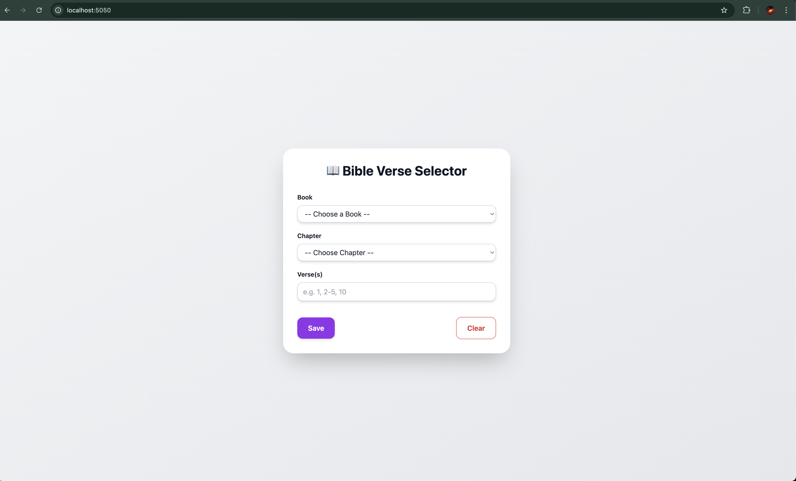

# ✝️ Verse Display Server

A lightweight **Flask + TailwindCSS** app to select and display Bible verses (English + Hindi). The selected verse is cached locally and viewable on any device in your network.

---

## 🚀 Features

- Select **Book**, **Chapter**, and **Verses**
- Dual-language display: **English | Hindi**
- Cached in `tmp/verse_cache.json`
- Clear selection anytime
- Fullscreen display view for streaming or projection

---

## ⚙️ Setup

### 1) Clone the repository

```bash
git clone https://github.com/p-paul-jonathan/verse-display-server
cd verse-display-server
```

### 2) Run the initialization script

```bash
./init.sh
```

This will do the following things
- Initialize Python virtual Environment if needed
- Install the required packages (i.e Flask) if needed
- Start the Server at http://localhost:5050

> Note: The server will be available and accessible to all devices on your local network, they can access it through `http://<YOUR_LINK_LOCAL_IP>:5050`

> to re run the program you can still use `init.sh`, it will not re initialize, it will just run the server

---

## 🧩 Notes
- `books.json` contains all the bible book names as a list with dictionaries with 2 keys `english` and `hindi`, which have the Bible book names in each language


## 📸 Screenshots
- The Main screen, this contains a form to select verses, clear the cache, and save the current verse to display on the display screen, available at http://localhost:5050

    - Main Screen
        

    - Select Book
        

    - Select Chapter
        

    - Select Verse
        

    - Main Screen when cachce Exists
        

    - Main Screen when cache is cleared
        


- The Display screen, this contains a display of the current verse which can be used as a source on various streaming softwares like OBS, available at http://localhost:5050/display
    > Note that the display screen refreshes every 3 seconds, so as to create a live update for streaming


    - Display Screen
        

    - Display Screen when Cache cleared
        

> TODO: Add a dark mode?
